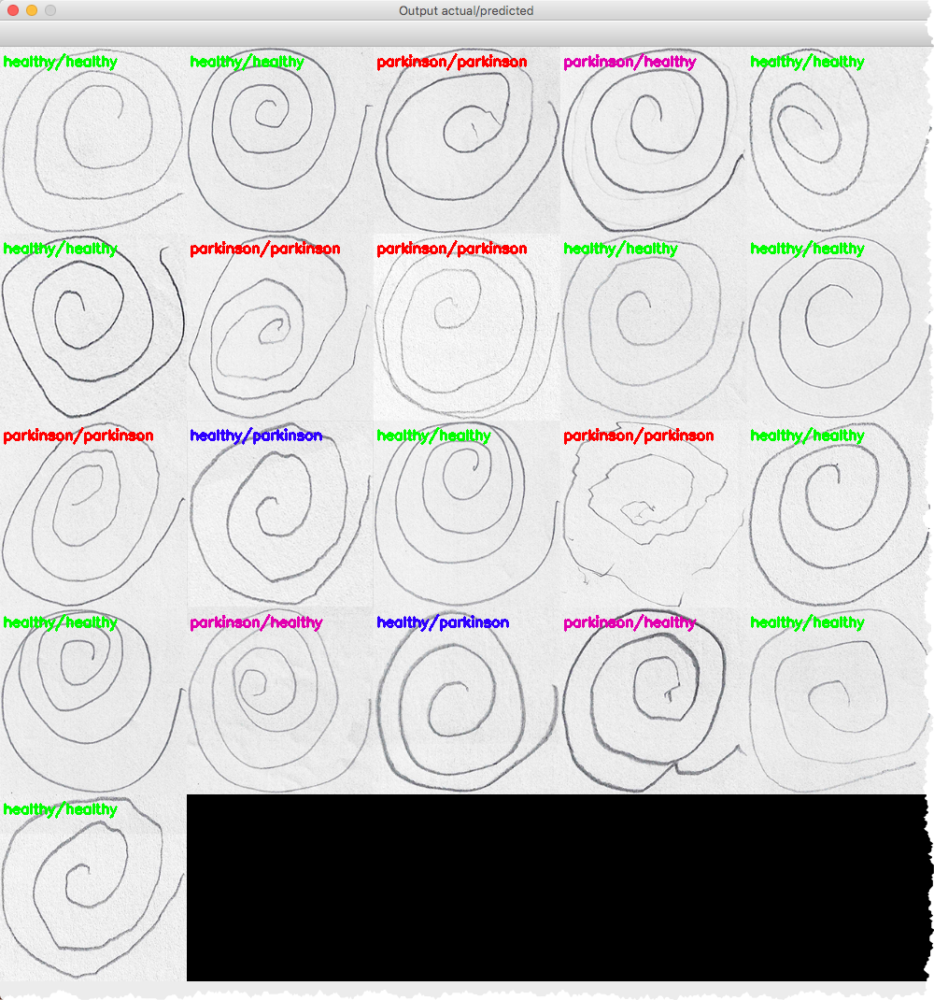

# PyImageSearch Detecting Parkinson's

This blog post talked about how to detect parkinson's from the spiral test images.

You can find the blog here

[PyImageSearch Detect Parkinsons](https://www.pyimagesearch.com/2019/04/29/detecting-parkinsons-disease-with-opencv-computer-vision-and-the-spiral-wave-test/)

There was a gurus sample that he mentioned that discussed the *feature.hog* parameters.

[HOG Gurus](https://gurus.pyimagesearch.com/lesson-sample-histogram-of-oriented-gradients-and-car-logo-recognition/)

## My changes

I used much of the material concerning the training of the model and generating the feature data.  However I made the following changes/updates:

- I have a collection of models to test.  

- I create a 20% holdout dataset, then I use 5-Fold cross validation on the remaining, then take the best model ( or the one selected ) and predict on the hold out set.

- I updated the final display to show the holdout set, and the actual/predicted values in different colors to highlight the false negatives ( where the model incorrectly said the person did not have parkinsons, but in fact the person did)

- I print out the confusion matrix and classification report

